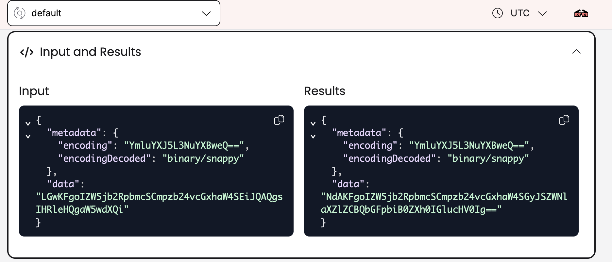
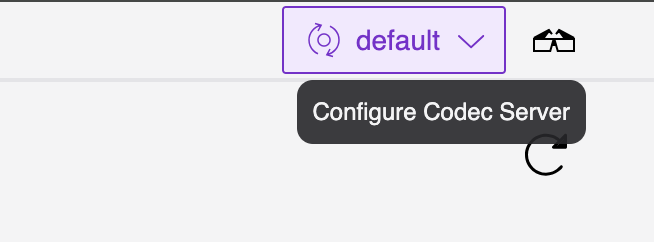
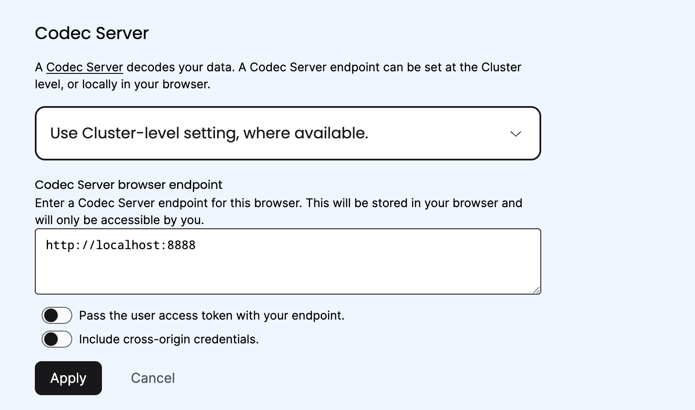
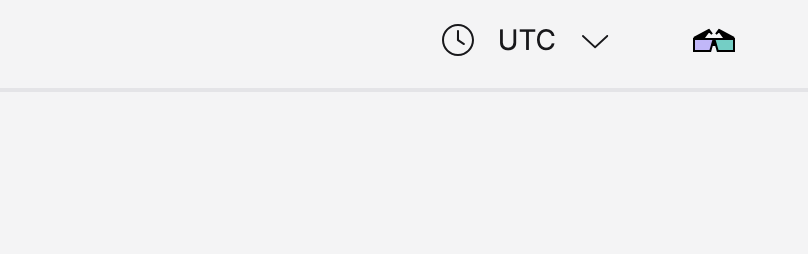
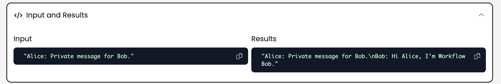

# Exercise 2: Deploy a Codec Server and Integrate with the Web UI

During this exercise, you will:

- Review a Codec Server implementation
- Configure a Codec Server to share converter logic
- Enable CORS and review other deployment parameters
- Integrate your Codec Server with the Temporal Web UI
- Securely return decoded results in the CLI and the Web UI

Make your changes to the code in the `practice` subdirectory (look for
`TODO` comments that will guide you to where you should make changes to
the code). If you need a hint or want to verify your changes, look at
the complete version in the `solution` subdirectory.

## Setup

You'll need two terminal windows for this exercise.

1. In all terminals, change to the `exercises/codec-server/practice` directory.
2. In one terminal, run `npm install` to install dependencies.

## Part A: Configure a Codec Server to Use Your Data Converter

1. First, you'll review a barebones Codec Server implementation in TypeScript, and make the necessary changes to integrate the Encryption Converter already supplied for you in this same directory. Examine the `codec-server.ts` file in the `codec-server` subdirectory. This file contains a complete HTTP server implementation using the [Express](https://www.npmjs.com/package/express) library. It contains endpoints at `/encode` and `/decode` as expected by the Temporal CLI, Web UI, and SDKs, and allows for CORS enablement. These are the baseline requirements for a Temporal Codec Server, which can be implemented using standard HTTP functionality in any language of your choosing.

2. Temporal Codec Servers need, at minimum, one additional configuration detail before they can be deployed from sample code. Specifically, Codec Servers need to import the Converter logic from your own application. Edit the `import` block at the top of `codec-server.ts` to import `encryption-codec`, also provided in the same directory, as a module named `EncryptionCodec`.

3. Next, in the `main` function call which sets up an Express server, instantiate a new variable named `codec` which await calls the `create` method on the `EncryptionCodec`. Pass in `test-key-id`. This is an identifier for a specific encryption key used by the codec.

4. After making these additions, you should have a functioning Codec Server, integrated with your application logic. Again, everything else in here is configured as generically as possible — note that this example Codec Server listens on port 8888. This fulfills all the requirements of a Temporal Codec Server, and you could incorporate any other authentication requirements on top of HTTP as needed. Run your Codec Server with `npm run codec-server` from the root of your project directory. This will block the terminal it runs in, and await connections.

5. Now you can retrieve the decoded output of your Workflow Execution from the Encryption Codec. From another terminal window, run `temporal workflow show \ -w codec-server-123 --codec-endpoint 'http://localhost:8888'`. It should retain the decoded result appended:

```
...
Result:
  Status: COMPLETED
  Output: ["Alice: Private message for Bob.\nBob: Hi Alice, I'm Workflow Bob."]
```

You now have a working Codec Server implementation. In the following steps, you'll learn how to integrate it more closely with a Temporal Cluster for production environments.

## Part B: Enable CORS and Configure Temporal Web UI Integration

1. The next step is to enable Codec Server integration with the Temporal Web UI. This isn't necessary if you don't plan to use the Web UI to view your Workflow output, but it provides a stock example of how to integrate Codec Server requests into a web app, and is supported by Temporal Cloud. Without Codec Server integration, the Temporal Web UI cannot decode output, and results are displayed encoded:



To do this, you first need to enable [CORS](https://en.wikipedia.org/wiki/Cross-origin_resource_sharing), a common HTTP feature for securely making cross-domain requests.

In order to enable CORS, we will use:

- [Express](https://www.npmjs.com/package/express): A Node.js web application framework that provides a is designed for building web applications and APIs
- [CORS](https://www.npmjs.com/package/cors): A package to enable Cross-Origin Resource Sharing with various options.

To enable CORS in your Express.js server, you need to use the cors middleware. This middleware allows you to specify various options to customize the CORS policy according to your needs. For example, you can specify which domains are allowed to access your server, which HTTP methods are allowed, and which headers can be included in the requests.

We will use `app.use(cors({origin: 'http://localhost:8233', allowedHeaders:['x-namespace', 'content-type']}))`.

For the Codec Server, we specify the `allowedHeaders` option to ensure that only requests with headers `x-namespace` and `content-type` can interact with the server. This is particularly important for ensuring that only legitimate requests are processed by your server. We will also use CORS to allow traffic specifically to `localhost:8233`, the default address for the Temporal Web UI.

2. Now you can proceed to integrate your Codec Server with the Web UI. You should already have a local Temporal Cluster running that you can access in a browser at `http://localhost:8233` by default. In the top-right corner of the Web UI, you should see a 3D glasses icon, where you can access the Codec server settings:



In the Codec Server settings menu, add the path to your Codec Server, which should be `http://localhost:8888`. You do not need to toggle the user access token settings if you aren't using authentication.



Note that you can toggle the "Use Cluster-level setting" option to save this Codec Server for all users of this cluster, or only for you, which would be especially relevant if you were running a `localhost` Codec Server with a remote Temporal Cluster. Click the "Apply" button. The 3D glasses in the top nav should now be colorized, indicating a successful connection:



3. When you navigate back to your Workflow History and scroll to the "Input and Results" section, you should find your payload automatically decoded by your Codec Server:



You now have a working Codec Server integration with the Temporal Web UI.

### This is the end of the exercise.
